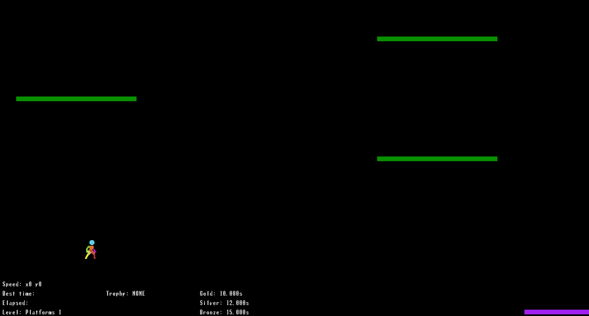

# Megajump

Megajump is a platformer where the focus is on doing high velocity jumps and landing them. Get to the exit as fast as possible!

You can download the latest build from: https://curbyourcode.itch.io/megajump.

Check out some gameplay here: https://www.youtube.com/watch?v=0Z7p4b1PllU.

## Building and running on Windows with IntelliJ

- Install Java JDK 17
- Then install IntelliJ Community Edition
- Clone this repository with Git
- Then import the cloned repository as a project in IntelliJ
- Set the project SDK to JDK 17 and the language level also to 17
- Setup project dependencies: add the libraries under the "lib" folder to the project
- Test compilation with "Build Project" at this point
- Setup a run configuration: add a new "Application" run configuration where the target is: com.orbinski.megajump.Boot
- Enjoy!

## Building and running on Windows with Ant

This is a little ham-fisted but it's simple and it works.

- Clone this repository with Git
- Open up File Explorer, go to the directory where you cloned the project, and create a directory named "inst" there (without the double quotes)
- Install the latest Ant version. Open up a command line prompt and test that the Ant commands work.
- Download the latest Java JDK 17 and JRE 17 versions
- Unzip the JDK file. Copy the unzipped folder under the "inst" subdirectory in this project.
  Example path: C:\Development\megajump\inst\jdk. Make sure the folder is renamed to "jdk" as in the previous path example (without the double quotes).
- Unzip the JRE file. Copy the unzipped folder under the "inst" subdirectory in this project.
  Example path: C:\Development\megajump\inst\jre. Make sure the folder is renamed to "jre" as in the previous path example (without the double quotes).
- Download and install the latest launch4j version
- Find where launch4j is installed and then copy the folder under the "inst" subdirectory in this project.
  Example path: Example path: C:\Development\megajump\inst\launch4j. Make sure the folder is renamed to "launch4j"
  as in the previous path example (without the double quotes).
- Open up a command line prompt, go to the project root, and build the project with the command: ant
- The following subdirectories should be created: dist and dist-zip. The dist subdirectory contains the game's resources
  and the executable. The dist-zip subdirectory contains a zip file with the contents of the dist subdirectory zipped.
- Run the game by running the executable Megajump.exe in the dist subdirectory.
